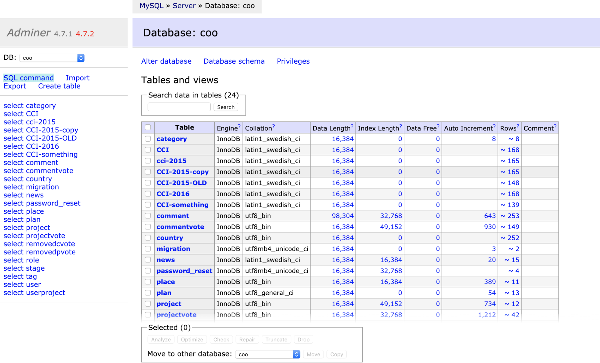

# COOPERACY CODERS


Hi and welcome to Cooperacy Coders main document. This is an introductory document for who wants to help the development and maintenance of the platform. You can read about the platform here: [https://cooperacy.org/platform](https://cooperacy.org/platform) . The official discussion channel is: [https://discord.gg/sKb5Ju](https://discord.gg/sKb5Ju)

You do not need to know or support the platform, for you it’s just a way to learn to code.

Because it is learning and coding, please feel free to ask.

I will say it again: nobody here is your teacher, we’ve got tasks for you and a lot to learn but it is not a "course", nobody will fill in the code for you, but it is expected from you to start with questions. You should learn to ask. Ask about your role, what can you help with, and when you receive a task, paste your code and ask: “What is wrong here?”. If you don't, maybe you'll feel the project is too complex, or you won't understand how it is structured, etc.

This is due to the fact some guys know html/css/js, some have vue too in their knowledge, some have a node background, some want to do backend. Better to start talking rather than expecting. So don't expect, communicate!

Moreover, it's a dynamic group. You are free and can come and go.
But.. remember to ask, communicate, interact.

**THE REPO**
We’re based on NODEJS, EXPRESS, VUE, VUEX, NUXT, BOOTSTRAP, BABEL, WEBPACK and a MySQL database. The need for MySQL instead of mongodb or other nosql is because we must address the relational structure for the platform.

If you do not understand something here, remember to ask :)

As head of the project, and because I am currently coding alone, I tend to prefer one-line coding rather than multi-line, but you can use whatever style you like. You can rewrite or reorganise the pages so that they are more standard, and help the project.

Again, communicate your doubts. And you will gradually be happy.

Thanks!

## CHALLENGE ONE: GITHUB!
If you pass this challenge you will be approaching the contributors zone, and be listed in the contributors.md file of this repo.
### GITHUB
Cooperacy is based on GitHub repositories. You find them here: [https://github.com/amdp](https://github.com/amdp)

For detailed and complete guide please see [https://guides.github.com/introduction/flow/](https://guides.github.com/introduction/flow/) . If you do not want to follow the guide, please… ask 😄

Git is quite complicated for newcomers so it is important for you to tell your difficulties. It is important that you learn it too though, because most of the world projects are updated thanks to the git process.

**Basically all you need to do is:**
1.  Creating github account.
    
2.  [Fork the repository](https://help.github.com/en/articles/fork-a-repo) and clone your fork (read [https://github.community/t5/How-to-use-Git-and-GitHub/Branch-VS-Fork/td-p/10619](https://github.community/t5/How-to-use-Git-and-GitHub/Branch-VS-Fork/td-p/10619) )
    
3.  Create a new branch in your fork
    
4.  Work with it, edit, write new code
    
5.  Test it locally
    
6.  Request a Pull / Merge
    
7.  Await for integration!

Last but not least, have fun.

For doubts about every step, please ask! :)

**Note:**

When you create a new branch, you can mess around as much as you like, you won't destroy the software. When you want to issue a pull request, you should send only the changes that really matter, not everything you changed for testing. So the branch is your playground, but when you want your changes to be sent to the main program for integration you tidy everything up and issue your pull request.
As per your first challenge, edit the contributors.md file and insert you in the learners list. Make a pull request and you're done.


### 2. MYSQL
Please install Mysql 5.7 ([https://dev.mysql.com/downloads/mysql/5.7.html#downloads](https://dev.mysql.com/downloads/mysql/5.7.html#downloads))

On windows, [https://dev.mysql.com/downloads/windows/installer/5.7.html](https://dev.mysql.com/downloads/windows/installer/5.7.html) (Note: MySQL Installer is 32 bit, but will install both 32 bit and 64 bit binaries.)

This step is not easy! If you find it difficult ASK!

To create a new database in MySql just follow the many guides online, you can also use "adminer" with root after having set a root password in MySQL:

[https://www.techrepublic.com/article/how-to-set-change-and-recover-a-mysql-root-password/](https://www.techrepublic.com/article/how-to-set-change-and-recover-a-mysql-root-password/)

Once root, create a new database and set up a user granting all privileges for the database to the user you created. Remember to give the user a password. Then log out and log in again not with root, but with the user.


Then run the long list of commands you find in the file dimbdatabase in the /etc or root folder of the repo: just copy ALL the text and then paste it using the sql commands in any database/sql editor/online tool (see https://www.adminer.org/ ) after you connected to your created database. This will give you some dumb data to test the platform. In adminer, open the right database and click on SQL command.



PS: Remember to start your mysql server!
PS: You need php to be installed to use adminer, if you don't want to use adminer you can use any tool like heidi or mysqlworkbench.

### 3. NODE AND NPM

Install Nodejs and Npm. First of all, node is based on npm, the package manager.

`'npm i xxx'` is the command that installs xxx
then there are other commands, like `'npm update'` or `'npm uninstall'`

If you add the switch `'-g'` when you install something, it will install globally, but it is not recommended, it’s better to install everything in the directory of your repository so that when you delete it you have nothing installed in your main system. ONLY npm and few other stuff have to be installed globally.

The npm manager works with the `'package.json'` file that you have in the main folder of the repo:
```
    "@nuxtjs/auth": "^4.8.1",
...
    "bootstrap": "^4.1.3",
    "bootstrap-vue": "^2.0.0-rc.26",
...
```
all these are currently build dependencies, but you can also separate them into build (the ones you see) and for example dev-dependencies. You can see in the same file the line:
`"devDependencies": {}`

in node there is a difference between coding to test (dev) and setting up the environment for "production" or "online": build means we're going to go online and we do not need special features like autoreload. It's like when a dress has the marks with chalk or the needles, it's not definitive and you need it like that to play with it a little bit when you are measuring it or testing if it fits you. When you wear it, it's online :)

### 4. NUXT
VUE AND NUXT
Basically nuxt makes SSR easier, it renders the files both on server and on client side for better performance. Vue, instead, is very nice as lets you have DYNAMIC VARIABLES in your html code. For example, you can have a "for" loop into a div, and the div will automagically produce many divs as many elements in the for loop. Imagine you have a list of projects in a database, they will be cycled by the for loop and rendered, with a simple instruction in the html tag. Finally you can have COMPONENTS, that are pieces of code that you refer to with a simple tag, for example to insert the "banner" code into any of your pages, you would just enter <banner /> in your html and.. ta-daan, there it is.
For more info, please ask!

CSS
We use bootstrap + a single coo.css file. Keep in mind, though, that Vue uses VueBootrap, an ad-hoc version of Bootstrap. Nothing really complicated, but in case.. please ask! :)

INSTALLATION
To set the repo up, go to its directory (if you downloaded a zip, extract it). Then run ‘npm i’, it will install all the required files.
Rename the dumbenv file you find in /etc or root folder in a file named ‘.env’ 
Finally, to start the repo, run: ‘npm run dev‘: it will run nuxt in development mode. If you get the error ETIMEDOUT check that HOST is 127.0.0.1 or ‘localhost’.

## SETUP

**THE REPO AND THE THREE FILES**

There are three important files :

1. nuxt.config.js This is the nuxt configuration. It’s some config that allows nuxt to work properly.

2. db.js This is a very long file with all the node.js backend. It’s full of instructions for the database.

3. store/index.js store/index.js is VUEX. It’s sort of complicated, this stores variables coming from the database in a way that all the client side may access to them independently from the starting file/url.

To see the registered user pages, go to login and register, but do not hit PAYPAL, just use BANK TRANSFER.

nuxt has three layers

CLIENT => VUE // VUEX // NODE <= SERVER

## FINAL STUFF

1. Contributors
Other contributors email: athxp@tutanota.com
2. Other stuff
3. Last
Remember: have fun! :D
