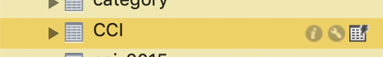

# COOPERACY CODERS


Hi and welcome to Cooperacy Coders main document.

This is an introductory document for those who want to help the development and maintenance of the platform.

It is structured as a ***game***
so that you know your learning curve 
and keep track of your achievements.

You can read about the platform here:
https://cooperacy.org/platform


**The official discussion channel is:**
https://discord.gg/sKb5Ju


Note: You do not need to know or support the platform, for you it’s just a way to learn to code.


IF YOU START THIS LEARNING GAME KEEP IN MIND WE UPDATE IT QUITE OFTEN,
SO REMEMBER TO PULL OR GET BACK TO THIS FILE SO YOU READ THE MOST
RECENT VERSION!


Because it is learning and coding, 
please feel free to ask.
I will say it again: nobody here is your teacher, 
we’ve got tasks for you and a lot to learn
but it is not a "course", 
nobody will fill in the code for you,
 but it is expected from you 
to start with questions. 
You should learn to ask. 
Ask about your role, 
what can you help with,
and when you receive a task, 
paste your code and ask: 
“What is wrong here?”. 
If you don't, maybe you'll feel 
the project is too complex, 
or you won't understand 
how it is structured, etc.
This is due to the fact some 
guys know html/css/js, 
some have vue too in their knowledge,
some have a node background, 
some want to do backend. 
Better to start talking 
rather than expecting.
So don't expect, communicate!


Moreover, it's a dynamic group. 
You are free and can come and go.
But.. remember to ask, communicate, interact.

**THE REPO**

We’re based on NODEJS, EXPRESS, VUE, 
VUEX, NUXT, BOOTSTRAP, BABEL, WEBPACK
 and a MySQL database. The need for 
MySQL instead of mongodb or other 
nosql is because we must address 
the relational structure for the 
platform.

If you do not understand something here,
remember to ask :)

As head of the project, 
and because I am currently coding alone,
 I tend to prefer one-line coding 
rather than multi-line, but you can 
use whatever style you like. 
You can rewrite or reorganise the 
pages so that they are more standard,
 and help the project this way.

Again, communicate your doubts. 
And you will gradually be happy.

Thanks!

Alessandro Merletti De Palo (amdp)


## THE GAME: LEVEL ONE

So let's begin! Overcome the following challenges
to get deeper and deeper in the learning of
the different coding aspects!

### CHALLENGE ONE: GITHUB!

If you pass this challenge you 
will be approaching the contributors 
zone, and be listed in the 
contributors.md file of this repo.

GITHUB

Cooperacy is based on GitHub repositories. 
You find them here: https://github.com/amdp/cooperacynuxt

For detailed and complete guide please see 
https://guides.github.com/introduction/flow/.
If you do not want to follow the guide, please… ask 😄

Git is quite complicated for newcomers 
so it is important for you to tell your 
difficulties. It is important that you learn it
too though, because most of the world projects 
are updated thanks to the git process.

**Basically all you need to do is:**
1.  Creating github account.
    
2.  [Fork the repository]
https://help.github.com/en/articles/fork-a-repo
and clone your fork 
(read https://github.community/t5/How-to-use-Git-and-GitHub/Branch-VS-Fork/td-p/10619 )
    
3.  Create a new branch in your fork
    
4.  Work with it, edit, write new code
    
5.  Test it locally
    
6.  Request a Pull / Merge
    
7.  Await for integration!

Last but not least, have fun.

For doubts about every step, please ask! :)

**Note:**

When you create a new branch on the 
clone of your fork, you can mess 
around as much as you like, you won't 
destroy the software. When you want to
issue a pull request, you should send 
only the changes that really matter, 
not everything you changed for testing. 
So the branch is your playground, but 
when you want your changes to be sent 
to the main program for integration 
you tidy everything up and issue your 
pull request.

***As per your first challenge, 
edit the contributors.md file 
and insert you in the "learners" list.***

Finally, make a pull request and you're done!


### CHALLENGE 2: INSTALL MYSQL AND APACHE
Please install Mysql 5.7 ([https://dev.mysql.com/downloads/mysql/5.7.html#downloads](https://dev.mysql.com/downloads/mysql/5.7.html#downloads))

On windows, [https://dev.mysql.com/downloads/windows/installer/5.7.html](https://dev.mysql.com/downloads/windows/installer/5.7.html) (Note: MySQL Installer is 32 bit, but will install both 32 bit and 64 bit binaries.)

This step is not easy! If you find it difficult ASK!

To create a new database in MySql just 
follow the many guides online, we suggest you
to use mysql workbench:
https://www.mysql.com/it/products/workbench/

Once connected, create a new database and 
it is suggested to set up a new user granting it
all privileges for the database you created. 
Remember to give the user a password. 
Then log out and log in again not with root, 
but with the user.

Then you should run the long list of commands 
you find in the file dumbdatabase.sql in the 
/etc folder of the repo: open it or just copy ALL
the text and then paste it in the sql command box
in any database/sql editor/online tool like
workbench, only after you connected to your newly 
created database. This will give you some dumb data
to test the platform. In workbench, just open the sql
or copy its text into a sql command/query.

PS: Remember to start your mysql server!

NOTE: we recently edited the dumbdatabase so if
you encounter problems please let us know.

Workbench is strange to use at the beginning but
once you copied the dunb database just 
remember to open the left side pane "schema" 
and to click on tables, you will see a list of
tables and to see the actual data or schema
click on the tiny icon close to the same name:



When you have done this step, just install Apache too
or any other http server.
At the end, edit the contributors.md 
and add your email after your name! You did it!!

### FINAL CHALLENGE LEVEL ONE: INSTALL NODE, NPM AND NUXT

First of all, you should know node is based on npm,
the package manager. You should follow an online
guide to install node and npm. It shouldn't be
that hard.

`'npm i xxx'` is the command that installs xxx
then there are other commands, like `'npm update'` 
or `'npm uninstall'` or `'npm remove'` (these last
two have the same function).


If you add the switch `'-g'` when you install 
something, it will install globally, but it is 
not recommended, it’s better to install everything 
in the directory of your repository so that when 
you delete it you have nothing installed in your 
main system. ONLY npm -the package manager- and 
few other stuff have to be installed globally.


The npm manager works with the `'package.json'` file 
that you have in the main folder of the repo:
```
    "@nuxtjs/auth": "^4.8.1",
...
    "bootstrap": "^4.1.3",
    "bootstrap-vue": "^2.0.0-rc.26",
...
```
all these are currently build dependencies, 
but you can also separate them into build (the 
ones you see) and for example dev-dependencies. 

You can see in the same file the line:
`"devDependencies": {}`

in node there is a difference between coding to 
test (dev) and setting up the environment for 
"production" or "online": build means we're going 
to go online and we do not need special 
features like autoreload. It's like when a dress 
has the marks with chalk or the needles, it's not 
definitive and you need it like that because you
need to play with it a little bit when you 
are measuring it or testing if it fits you. 

When you wear it, instead, it's online :)


Did you install node and npm? 
You are now ready to install the repo, 
and gain level 2!

VUE AND NUXT
Basically nuxt makes SSR easier, it renders the
files both on server and on client side for 
better performance. Vue, instead, is very nice as 
lets you have DYNAMIC VARIABLES in your html code. 
For example, you can have a "for" loop into a div, 
and the div will automagically produce many divs 
as many elements in the for loop. Imagine you have 
a list of projects in a database, they will be 
cycled by the for loop and rendered, with a simple 
instruction in the html tag. Finally you can have 
COMPONENTS, that are pieces of code that you refer 
to with a simple tag, for example to insert the 
"banner" code into any of your pages, you would 
just enter <banner /> in your html and.. ta-daan, 
there it is.

For more info, please ask!


CSS
We use bootstrap + a single coo.css file. 
Keep in mind, though, that Vue uses VueBootrap, 
an ad-hoc version of Bootstrap. 

Nothing really complicated, but in case.. please ask! :)


INSTALLATION
To set the repo up, go to its directory (if you 
downloaded a zip, extract it). Then run ‘npm i’, 
it will install all the required files.


Copy the `'dumbenv'` file you find in `'/etc'` folder to the root of the project, rename it to `'.env'` and edit it according to its suggestions.


Finally, to start the repo, run: ‘npm run dev‘: 
it will run nuxt in development mode. 

Errors:
If you get the error ETIMEDOUT check that HOST 
is 127.0.0.1 or ‘localhost’.

If you get the error CONNECTION REFUSED it is
probable that MySQL is not running or that 
your MySQL user and password aren't set
correctly.

There could be some other issues, so please 
learn to ask in the discord server about 
how to solve them.

If you see the colorful cooperacy circle 
you've done it! Send a screenshot in the discord 
server and celebrate!

You passed the level! In the contributors.md move 
your line to the NUXTERS level!

## LEVEL TWO: NUXT BASE LEARNING

### CHALLENGE ONE: THE DIRECTORY STRUCTURE

This first challenge is made of reading.
If you read carefully you will be passing it!

What is Nuxt? NUXT IS A VUE FRAMEWORK
It is used to have a quicker development
of a universal application (server side 
rendered, progressive web app ready,
mobile ready, desktop ready, etc.)


Remember you start Nuxt with

`npm run dev`

and you stop it with CONTROL-C .
Try and test these two commands and
check that when you see nuxt
compiling/loading, you can open the
browser and see it load clientside:
you will see the green nuxt icon
and the load bars :)


Good. The directory structure in NUXT is made of 
these folders:


ASSETS = css, images, etc

COMPONENTS = vue components, "reusable parts"

LAYOUTS = layouts, like presets with footer and header

node_modules = BIG folder with all the node modules
 
PAGES = web vue dynamic pages

STATIC = try not to use this, 
it is not SERVER SIDE RENDERED NOR GENERALLY "NUXTED"
we will eventually leave only the favicon here

STORE = VUEX, or "variables shared in all vue pages"


note: keep in mind for your projects that STORE 
works in nuxt only if you put an index.js file there
no file, no store

Got it? Good. Screenshot the directory structure
in your local repo
send it to the discord server and you 
would have passed CHALLENGE ONE!

### CHALLENGE TWO: THE REPO AND THE THREE LAYERS

Before starting to give you tasks to learn Vue,
let's understand how Nuxt plays between Vue
and the information stored in the server.


Remember: your computer connects to internet
via a browser, this means you are a "client".


On the other side, there is a Server.


To make the client to talk with the server,
you can have two layers, the client one and
the server one.


So when you need data from the server, you send
an "XMLHTTPRequest" and the server answers with
some info. Ping... pong.


In Vue the REQUEST TO and THE ANSWER FROM the 
server CAN be handled by a "store".
They could also work without, but in complex
projects you would need a STORE.


This store is like harbour docks, people ask
for more food at the market (client), and
the market owners go to the docks and tell 
some ships to go and get some food from oversea.


The market owners talk to the docks store,
those huge containers you see in the docks.


The docks send their ships, the ships go
oversea (server) and get the food (data),
then they get back and fill all the 
containers (store) with their contents.


So the docks store the food (data) and
all the market can access it until the
day ends (connection is closed) and the
people (client) are satisfied.


So there are three important files :

1. nuxt.config.js This is the nuxt configuration.
It’s some config that allows nuxt to work properly.

2. store/index.js is the VUEX STORE.
VUEX is just the name of the library,
or better the "state management library" 
that creates the STORE.

This is the docks, it stores data variables 
coming from the ships that went to the database
in a way that the client may 
access to them independently from the starting
market stand, represented by a page file or url.

3. db.js This is a very long file with all the 
node.js backend. It’s full of instructions for 
the database. This is used when the docks (the store)
sends ships to the server and the ships arrive:
should they get some food? Post some data?
Delete an order? Deliver messages?

All these operations are also called API.
The db.js is the API that talks with the server.
We will learn more about it.


So nuxt has three layers:

1 VUE (CLIENT) // 2 VUEX (STORE) // 3 NODE (SERVER)


when you land in a page, 
you are the client
and vue renders the page reading 
the HTML part: see aboutus.vue
for example. It starts with
<template> and ends with </template>,
and it seems pretty much like
standard html.

In fact, Vue is a "progressive
framework" that enhances standard
html with new functionalities.
So the client reads the Vue file
and renders the aboutus vue page.

Go to 127.0.0.1/aboutus and you
will see it.


In some cases, instead, vue executes 
the <SCRIPT> part at the end of the 
.vue file, with some functions
and some CALLS.
 
These calls go to the VUEX store,
to the docks of the previous example,
because they want the ships to go
and carry DATA from the oversea
server. 

How do we recognise these calls?
It's easy, they all start with $store,
or with "this.$store".

For example this.$store.dispatch.
Like in the docks, the STORE
dispatches a message through the
ships in order to get data
from the "oversea" server.


In order to understand, 
see for example index.vue.

In that file (today, end of july), 
you see an async fetch function.
You will learn about the fetch 
function later. That function has
a "store.dispatch" command that is
related to the VUEX store.
You found it? GOOD!


So, "store" is VUEX. 
In this case for the fetch function 
you do not have the word "this"
like in "this.$store.dispatch". 
They are similar commands though,
just remember that store 
refers to the VUEX file 
/store/index.js

Now send in the discord server
a screenshot of the /store/index.js
file and you passed this 
second challenge!

### FINAL CHALLENGE LEVEL TWO: RECONSTRUCT A WHOLE STORE PATH!


Alright then. It's time to see the docks!
Open the file /store/index.js!


What's in it?
The store has a STATE list, 
that is "LIKE" global variables,
they are "LIKE" globals, not the same.

States are variables accessible from
any vue file, which is good because
sometimes you need to have common
variables across your web pages.


Let's see the store/index.js:
the first part is made of STATES.
`export const state` tells nuxt 
to export from this file the STATES.

Every comma separate a state element.
To call these elements, just imagine
in the <SCRIPT> part of your vue page
to type "this.$store.state.xxxvariablexxx".
 
For example, to retrieve the projects,
you would type in a function:
"this.$store.state.project"
or "store.state.project".

These states are constants,
so they are immutable once they arrive
in the docks store (remember the ships?)

In the reality these states can be changed,
but ONLY BY VUEX store commands,
you can never assign them:
`this.store.state.project = 
[project1, project2, project3]`
would never work.
The commands able to change the states
are called MUTATIONS, and they
come from ACTIONS.


But let's go ahead. 
You see in the file you have also 
"getters", in NUXT the getters are 
less used because of NUXT structure 
itself, so focus on vuex store 
"mutations" and "actions" now.


The mutations SET the store STATES,
they are like the docks workers,
this means they fill the "containers"
of the docks with data usually got 
from the database.

But how do we get the data?
We need to send ships, so here we 
go with the ACTIONS!

The actions are the ships: they go to the 
server database, get the data and 
get back with it. Then they give the data 
to the mutations "workers" that fill 
the "docks containers", the STATE variables.


Again:


STATE = "the containers",

list of shared variables that can be 
used THROUGH vue components and pages

MUTATIONS = "the workers"

internal VUEX commands that SET 
or CHANGE the STATE variables

ACTIONS = "the ships"
used to go to the server 
and get the data out of the DB
or execute other commands
and then mutate the STATE
variables with the DB info


So when NUXT builds,
it sets a list of VUEX STATE 
variables and when a client 
goes on the pages with
STORE calls, it triggers 
STORE ACTIONS that go to the 
database and come back. 
When they are back they 
ask the MUTATIONS to change 
the STATE variables.

Final info:

ONLY ACTIONS go to the database.
They do this in our case through the
axios module.
Axios just simplifies XMLHttpRequests
but we could use XMLHttpRequests 
directly.
Axios or XMLHttpRequests are like
paper orders the ships carry and
give to the server when they arrive.
Those orders are executed and GET,
POST, PUT, DELETE things. Usually
the orders tell to GET DATA.

In any case, the actions use axios 
or xmlhttp requests to get info from 
the remote server database and mutate
the vuex state variables.


Well done! To overcome this challenge 
you have a difficult task: go to
`/pages/index.vue`
get the name of the "store.dispatch"
ACTION. It is between quotes.


Then go to
`/store/index.js`
and look for the same ACTION.
Inside of the ACTION find the
"axios" directive, it shoould be a
"axios.get" one. After the word
DBURL you will find a quoted PATH,
similar to the ACTION name.
Keep that path in mind.

Now go to the file
`/db.js`
in the ///// GET /////
part, look for the same path after
something similar to "axios.get":
`app.get(`

If you find it, copy all of it 
and paste it in the discord server.
If it is the right one, you gained
another level!
CONGRATULATIONS!
You now earned the VUEX EXPLORER LEVEL!

## LEVEL THREE: BACK TO THE BASICS

In this upcoming lessons we will start 
back from basic html and learn step by step
Vue, Vuex and the rest of NUXT.
Overcoming this last third LEVEL you will
start a final level to be part of the
real developers: the CONTRIBUTORS!

### CHALLENGE ONE: ONE SIMPLE VARIABLE AND ONE SIMPLE FUNCTION IN VUE


VUE AND NUXT
Vue works mostly with pages and components. 
Pages are htmls with the special Vue 
functionalities and dynamic tricks.
Components are reusable bits of code,
part of pages that you can reuse in any page.
Be aware, though, that in NUXT some Vue 
stuff will work differently.
Some functions DO NOT WORK in 
components, like, do you guys remember 
the async fetch function you saw in
the index.vue page?
If you use that special function
in a component it won't work.


So VUE is quite similar to HTML with
some powerful tricks in the script part
let's see what could be interesting
of the script you find at the end of 
the Vue pages.

The most simple and important function
is the data() function

The syntax is data() { return { ..} }
In data() you can add a
list of variables you
want to use in the HTML
or for your other functionalities.


I rarely use the same name
for variables of different
use, so, if I have to send
to the server a username through 
a form, I will user formUsername
for the variable in the form,
and `username: formUsername` when
I will send the username to
the server, so I know that
I am assigning the fromUsername 
text in the form box TO the
username variable I am sending to
the server.

I can easily recognise which is 
the page form variable
and which is the one 
I am sending to the server.


methods: {..} is a list of functions
it lists the functions you want to use
in your page.


Now, let's test it. Let's take any page
.vue we already have in the project 
and insert in the data function one 
variable:

```
data() {
  return {
    test: 'test ok!' //use whatever text you want here
  } }
```

and in `methods:` another function:

```
methods: {
  someAlert(){
   alert(this.test)
  }
}
```

and now let's add a div with a
@click in the middle of 
the html part:

```
 <div @click="someAlert">TEST ALERT</div>
```

Now reload the page, and if clicking on 
the div with TEST ALERT you get an alert
you've done it!
Screenshot your alert message and paste it
in the discord channel :)

### CHALLENGE TWO: REGISTER AND MAKE A LITTLE EDIT IN MYSQL

Okay then let's use the platform.
Go to LOGIN as in the right menu.
Scroll down and enter your name,
surname, email and password..
eventually a pic of yours.
Nothing will be sent to the 
real cooperacy project, so
don't worry and hit on bank transfer.


A new user will be created without any 
bank transfer. Now, open your mysql
workbench software or similar and
open the user table.

Refer to the beginning section of this
document to click in the small icon and
make the table to appear.


Now find your user, and edit "payment
deadline". Insert any date AFTER today
remembering the format is `YYYY-MM-DD 00:00:00`
obviously you can edit the time `00:00:00`
but it doesn't really change the situation.


Apply your changes and try to login with
your credentials. If you did, congratulations!
You passed challenge two! Please post in
the discord channel the screenshot of your
user when you are logged in :)

### FINAL CHALLENGE LEVEL THREE: VUE COMPONENTS AND A NEW COOPERACY PROJECT

Very well!! The rest of Vue you must learn should
be learnt by doing. We just need one final step:
components. At the same time, in Cooperacy we have 
some projects in the home page that are general,
while you can see, if you log in, YOUR created 
and archived projects. 
So let's create our first Cooperacy
project. Login and click on "add a new project" 
link.


Enter whatever you like, and then when you get
a confirmation go back to your profile clicking
on the image close to your name in the header.


You see your project there, right?
Well, now just for the sake of an experiment,
let's add the homepage logo into your user
page. How?
Just adding one component.


Let's start having a look at the component folder.
We will add the `home.vue` component.
Go to the user.vue page. Add after:

`<projectlist />`

the component:

`<home />`

but not after the closing `</div></template>`.


Now go to the script part and add after:

`import projectlist from '@/components/projectlist'`

the line

`import home from '@/components/home'`


what else? As a final step, edit the
component line:

```
components: { projectlist: projectlist, },
```

into:

```
 components: { 
  projectlist: projectlist, 
  home: home,
 },
```

now save and reload your user page if it didn't
automagically as usually nuxt does.
Scroll down and you should see the Cooperacy
logo animation.

Screenshot it and you will demonstrate to the
discord channel you learned that for inserting a
vue component you need to add the component tag,
import the document before the `export default`
line and finally to add it to the `components:`
line. Now you can even help the others
in the lower level with their 
difficulties, you gained the APPRENTICE level!
Edit the contributors.md and put your
name in the right position!
You also demonstrated you passed the final 
challenge before starting to develop!!

## FINAL LEVEL: START DEVELOPING!

THE CONTACT FORM

Let's try to make the CONTACT FORM on our own.
First of all, let's open db.js.
You'll see in the first lines
many declarations.
Express, bodyparser, till Mysql2 are
tools node uses to handle the 
requests, do server stuff etc.
The first lines are thus for 
server node functionalities.


app.xx is the Express object 
that calls the different functions:

"app.get" corresponds to GET XMLHTTP axios requests

"app.post" to POST XMLHTTP requests and so on


mydb is the mysql connection,

mydb.execute() is to issue 
commands to the mysql server
and databases.


req and res are two very important
variables relative to the request 
and the response of the server

So if you see res.send(), the server
is sending the response to the client.

If you see req.body.user, you are
referencing the BODY of the request
and pointing to the "user" variable
that you sent to the server.

The 'SELECT blabla' lines are SQL
commands or queries sent to MYSQL.

The contact page should be easier
to develop as it has no MYSQL call
but goes to the server to 
send an email, so it is our first
developer challenge.

The page you wanna start with is
contact.vue, just have a look
copy it and rename it contact2.vue
with an empty file.
Try to write it in your way.
You need to enter the html part
and the script one.
You would need to insert a 
google captcha too.

You can use all the other vue pages
as hints. For example, useredit.vue 
could be used as hint for creating
the form.

As you see, we should use 
VUE BOOTSTRAP HTML TAGS
so extra homework could 
be to turn the `<div class="row">`
into `<b-row>`.
 
Read about vue bootstrap here:
https://bootstrap-vue.js.org/docs/components

SCRIPT PART

So, as you see, in useredit.vue
you have the list of the form 
variables in data(){return{.. }


So try to create some vue bootstrap
form and add all its variables
in the script part into the 
data() function.


The middleware: ['auth'] 
is just to make it private,
that is, for logged in members,
so you should remove it.


methods: { ..}, as we know,
is for js functions.
You should make only one 
function connected to the form
that sends the contact 
form info to the server so that
the server sends the email to 
cooperacy@cooperacy.org.


How do we do that?
We simply copy the way
useredit "edits" the user.

You will see this:


         `    async userUpdate(){
      var updateUser = await this.$store.dispatch('updateUserAction', { 
        id: this.id,
        name: this.formName,
        surname: this.formSurname,
        email: this.formEmail,
        password: this.formPassword,
      })`
        
        
the "dispatch" triggers the action
in /store/index.js and after the
name of the action and the COMMA ,
you insert the data to be sent, 
in this case
data that corresponds to the
form variables.
You send them to the PAYLOAD object 
that you will find in the VUEX action:


`    { 
        id: this.id,
        name: this.formName,
        surname: this.formSurname,
        email: this.formEmail,
        password: this.formPassword,
      })`
      

this part is clear, form data
becomes data for the server: 
this is what in the VUEX action 
will be called "payload".


VUEX PAYLOAD

What is a payload? Do you remember
the anaology with the market
and the ships? Payload is what
the ships load, carry and deliver
to the server.

Payload is the container 
of the DATA that you pass 
to the VUEX ACTION
or mutation etc.
It is JUST A TERM.
VUEX likes to call it PAYLOAD.
it could be BOX, CONTAINER, HEIDI..
Being VUEX a "store"
like a place where you store stuff
payload is like stuff,
so you send the pack with 
the data inserted in the VUE form
to the "store".

The pack is called payload 
and awaits to be sent and 
receive something back.
The ACTION sends the payload 
to the server.


To send the contact email, you need 
to create a new VUEX action in the
/store/index.js. Call it 
contactAction2 and steal from this:


  `newuserAction: async (context, payload) => {let {data} = await axios.post(process.env.DBURL+'/user', payload)
    let go = {to: payload.email, subject: 'user registration confirmation', body: 'You have been registered.'}
    axios.post(process.env.DBURL+'/email', go); return data },`
    

`newuserAction: async (context, payload) => {`
is the standard for a vuex action in nuxt:
payload is the array or object in
which you insert all the form data
you retreive in the vue page.
Remember to update the "dispatch" in
the VUE page with the right VUEX
action name you just created.


Try to make your contact form
slightly different than the previous!


So, set the Action up in vuex
and prepare the "dispatch" in the
vue page to deliver the "payload"
to the VUEX store.

If you want to see what is inside
of a payload, you can use:

`console.log('payload: '+JSON.stringify(payload))`

of course you can use it for many
other debugging, but remember you
cannot use it with req.body!


SERVERSIDE

Now comes the final part: NODE.
Go to db.js, you'll find this 
function to steal from and use
for your contact form:


```
app.post('/email', function (req, res) {let transporter=nodemailer.createTransport({host:'ENTER YOUR SMTP like  smtp.gmail.com',port:465,secure:true, 
  auth:{user:'process.env.MAILUSER',pass:'process.ENV.MAILPASSWORD'}}) /* to add html in mailOptions use " html: '<b>test</b>' " */
  let mailOptions = {from: '"Cooperacy" <cooperacy@cooperacy.org>', to:req.body.to, subject:req.body.subject, text:req.body.body}
  transporter.sendMail(mailOptions, (error, info) => { if (error) { return console.error(error) }
      console.log('Message %s sent: %s', info.messageId, info.response); res.render('index') })}) 
```


This function uses nodemailer
a module to send emails via
nodejs/express.
It's one of the constants we defined 
in the top of the db.js file.

This function SENDS a mail 
to the user when s/he registers.

What we want instead is to SEND 
a mail to cooperacy@cooperacy.org
with some text in the contact
form box.
So `auth:{user:xx,pass:xx}` is fine,
while `from: '"Cooperacy" 
<cooperacy@cooperacy.org>'`, 
is wrong, I mean it is ok for the 
user function in db.js right now
but not for the one you should make!

The contact form is simply a mail 
you send to get some info
now let's focus on req.body


The bodyParser module 
transforms the payload
you sent via the VUEX
store, into variables called
request body, or, in short,
req.body.

So if payload has payload.to 
payload.baby and payload.mom
you will have req.body.to 
req.body.baby and req.body.mom.

It is just copying the VUEX
payload into something called req.body.

So now just duplicate the email function
and try to make that function to send
via your smtp server and using
your credentials a mail to
cooperacy@cooperacy.org

If you need to know if you sent an 
email, just check on your sent emails
folder.

Did you manage to send a contact email?
If you did it, move your name and email to
the "CONTRIBUTORS" level!!
Please also add your current COUNTRY!

If you didn't manage, don't worry,
write us in the discord channel and we
will help you out!

## LAST INFORMATION: A FEW WARNINGS

### WARNINGS

1. You cannot use `console.log(' '+JSON.stringify());`
with req.body, process.env, and some other objects, but
you can send to console their internal elements 
e.g. `console.log(' '+JSON.stringify(req.body.user));` .
When you use FormData() remember you
cannot console.log it. To log it, use:

```
for (var key of formData.entries()) {
  console.log(key[0] + ', ' + key[1])
}
```

2. Remember you cannot use fetch and
asyncData (nuxt functions) in components

3. Remember `let`, `var` and `const` are
different, so use them properly

4. Inserting dynamic images in nuxt is
more difficult than the standard vue 
because of babel, webpack and the nuxt
structure. So you would need to use a
computed: property or a methods: function.
Computed: are values like those in the data
function with the difference that they 
can be elaborated before
showing the page. 
Usually the `<img` tag is followed by
a dynamic source: ` :src=" ` that has
a function like `:src="getImage"`. Then,
script side, you have something like:

```
  computed: {
    getImage(){return require('../assets/image/'
    + project.image + '.png')},
    ...
  }
```

5. If you get an ERROR, remember to check 
the HTTP status error list:

https://developer.mozilla.org/en-US/docs/Web/HTTP/Status

IF SOMETHING GOES WRONG, REMEMBER TO ASK!
THANK YOU FOR PARTICIPATING AND.. HELP US IMPROVE THIS LEARNING GAME!
FOR ALL THE REST, ENJOY LIFE AND HAVE FUN!
